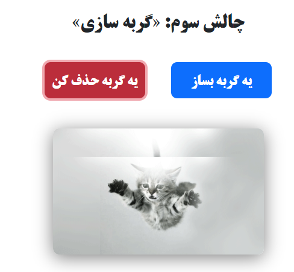

# Little and fun js challenges
> Here are some JavaScript challenges: Multiple games and simple applications in one page.
> You can reach this page throw [HERE](https://little-and-fun-js-challenges.glitch.me/).

> New challenges will be added to the list below over time.
## 1- Age in days calculator:

This little app calculates your age in days and print it on screen. It's based on your machin local date and get your birthday by a prompt.

## 2- "Rock, Paper, Scissor" game:

Here is a sticky game!

## 3- CAT GENERATOR!

In this app you can create an image by hit on blue button and delete last image by click on red button.

## 4- "Color GENERATOR" game:

You can create a new color by change color sliders and see rgb code of that color.

## 5- Stopwatch:

A handy stopwatch with lap and reset functions.

## 6- "Tic Tac Toe" game:

Challeng yourself with this game. For now there is no AI and you can do this game with your friend ;)

